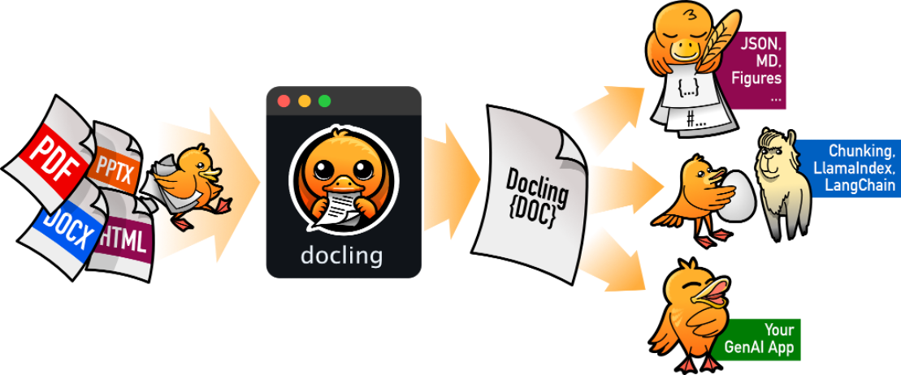

# Conversión de documentos con Docling

El propósito principal de Docling es la conversión de documentos. Docling nos permite convertir documentos en diversos formatos a otros más útiles para aplicaciones de IA, preservando la estructura y contenido del documento.

En este laboratorio revisaremos las distintas opciones de conversión que ofrece Docling, así como algunas funcionalidades de enriquecimiento. También exploraremos los documentos convertidos para ver cómo Docling almacena metadatos y preserva la estructura.


<!--  -->

## Prerrequisitos

Este laboratorio es un [notebook de Jupyter](https://jupyter.org/). Sigue las instrucciones del [trabajo previo](../pre-work/README.md) para ejecutarlo.

## Lab

[]({{ config.repo_url }}/blob/main/notebooks/Lab1_Docling_convert.ipynb){:target="_blank"}
[]({{ extra.colab_url }}/blob/main/notebooks/Lab1_Docling_convert.ipynb){:target="_blank"}


Para ejecutar el notebook desde la línea de comandos en Jupyter usando el entorno virtual activo del [trabajo previo](../pre-work/README.md#instalar-jupyter), ejecuta:

```shell
jupyter notebook notebooks/Lab1_Docling_convert.ipynb
```

La ruta del notebook anterior es relativa a la carpeta `docling-workshop` del repositorio de git clonado durante la sección de [preparación](../pre-work/README.md#clonar-el-repositorio-de-la-workshop-de-docling).