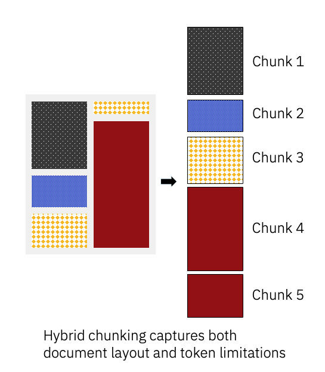

# Lab 2: Chunking y vectorización con Docling

## 🎯 Objetivo

En este laboratorio aprenderás sobre el chunking (fragmentación de documentos) y cómo Docling facilita este proceso crítico para sistemas RAG.

## 📚 Lo que aprenderás

- Qué es el chunking y por qué es importante
- Diferentes estrategias de chunking (semántico, jerárquico, híbrido)
- Cómo usar el chunker de Docling
- Preservar la estructura del documento en los chunks
- Generar embeddings de los chunks
- Evaluar la calidad de diferentes estrategias de chunking

## 🧩 ¿Qué es el Chunking?

El [chunking](https://www.ibm.com/architectures/papers/rag-cookbook/chunking) es el proceso de dividir textos largos en fragmentos más pequeños y manejables antes de pasarlos a un modelo. Es un paso importante porque:

- 📏 Los modelos tienen una longitud máxima de contexto
- 🎯 Mejora la precisión en la recuperación de información
- 💡 Ayuda a mantener la coherencia semántica
- ⚡ Optimiza el rendimiento en sistemas RAG

### Estrategias de Chunking en Docling

**Chunking Híbrido (Recomendado)**
- Combina límites de tamaño con estructura del documento
- Respeta encabezados, párrafos y secciones
- Mejor balance entre tamaño y coherencia

**Chunking Jerárquico**
- Mantiene la jerarquía completa del documento
- Ideal para documentos con estructura compleja
- Preserva el contexto entre secciones

**Chunking por Tokens**
- División por número fijo de tokens
- Predecible y consistente
- Útil cuando el tamaño es crítico

<div style="text-align: left;">
  
</div>

<!-- {: style="transform: scale(0.8); padding: 0px; margin: 0px;" } -->

Lee más sobre las distintas opciones de chunking en la [documentación de Docling](https://docling-project.github.io/docling/concepts/chunking/).

## Prerrequisitos

Este laboratorio es un [notebook de Jupyter](https://jupyter.org/). Sigue las instrucciones del [trabajo previo](../pre-work/README.md) para ejecutarlo.

## Lab

[]({{ config.repo_url }}/blob/main/notebooks/Lab2_Chunking.ipynb){:target="_blank"}
[]({{ extra.colab_url }}/blob/main/notebooks/Lab2_Chunking.ipynb){:target="_blank"}

Para ejecutar el notebook desde la línea de comandos en Jupyter usando el entorno virtual activo del [trabajo previo](../pre-work/README.md#instalar-jupyter), ejecuta:

```shell
jupyter notebook notebooks/Lab2_Chunking.ipynb
```

La ruta del notebook anterior es relativa a la carpeta `docling-workshop` del repositorio de git clonado durante la sección de [preparación](../pre-work/README.md#clonar-el-repositorio-de-la-workshop-de-docling).